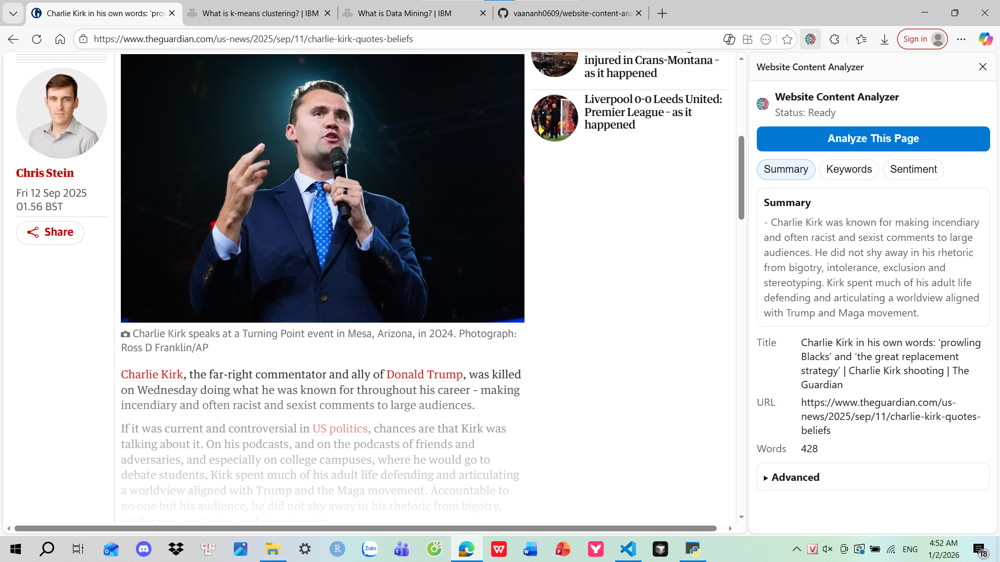
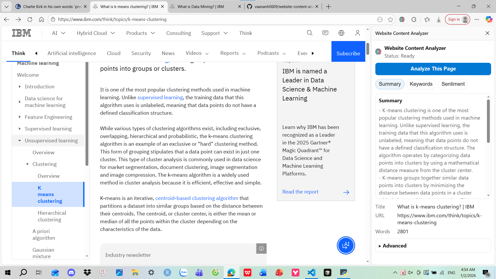
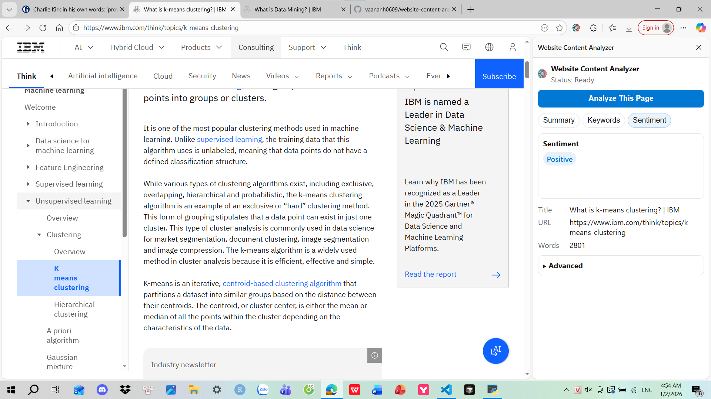
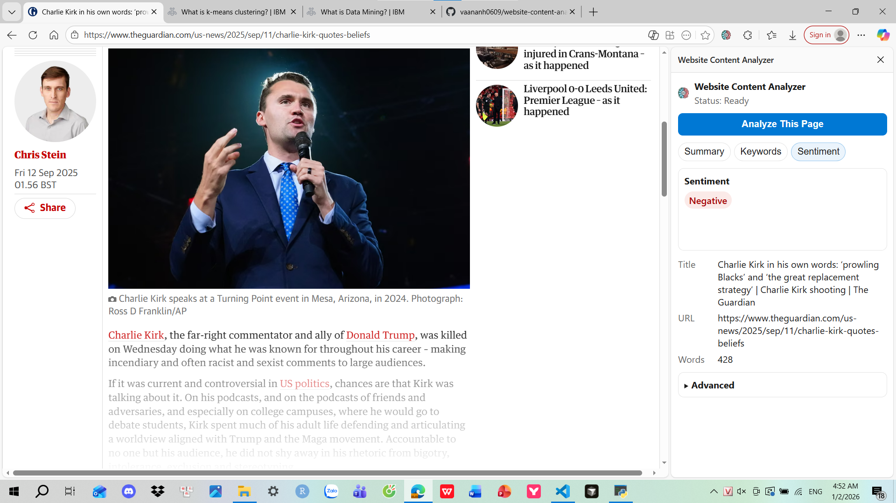

# Website Content Analyzer (Edge/Chrome Extension + Local NLP)

This Manifest V3 side-panel extension works entirely with a local FastAPI backend plus in-browser heuristics:

- **Summary**: chunked pages are sent to `http://127.0.0.1:8000/analyze`, where a cached Hugging Face BART model generates bullet summaries.
- **Keywords**: calculated in the side panel based on title/headings/main content with phrase-aware scoring and frequency counts.
- **Sentiment**: detected locally using weighted positive/negative lexicons tuned for news articles.

Everything stays on your machine. The extension only contacts `127.0.0.1` and never phones home.

## Requirements

- Windows
- Python 3.10+ recommended
- Edge or Chrome (MV3 + Side Panel support)

## 1) Run the local NLP backend

From the repository root:

1. Install dependencies:

	 `pip install -r requirements.txt`

2. Start the API:

	 `python -m uvicorn nlp_api:app --host 127.0.0.1 --port 8000`

Notes:

- The first run will download the summarization model (`sshleifer/distilbart-cnn-12-6`) into `model-cache/`.
- After the model is downloaded, summarization works offline.

## 2) Load the extension (unpacked)

### Microsoft Edge

1. Open `edge://extensions`
2. Turn on **Developer mode**
3. Click **Load unpacked**
4. Select this project folder (`website-content-analyzer`)

### Google Chrome

1. Open `chrome://extensions`
2. Turn on **Developer mode**
3. Click **Load unpacked**
4. Select this project folder (`website-content-analyzer`)

## 3) Walkthrough + Screens

1. Open any page you want to inspect.
2. Click the extension icon → a side panel opens.
3. Click **Analyze**. After the backend finishes, inspect the Summary/Keywords/Sentiment tabs. The screenshots below come from the current `assets/` folder for reference:

### Summary

*Screenshot: the first summary panel shows the chunked summaries produced by the backend alongside metadata.*

*Screenshot: scrolling further reveals more chunks summarized, illustrating how the side panel stacks bullet points per chunk.*

### Keywords

*Screenshot: the Keywords tab surfaces the top five SEO-weighted phrases along with their real occurrence counts.*

### Sentiment

*Screenshots: the sentiment pill toggles between positive and negative badges depending on the lexicon-based score.*

## Troubleshooting

- **“Local NLP service error” / Summary fails**
	- Ensure the backend is running: `http://127.0.0.1:8000/analyze`
	- Ensure no other app is using port `8000`

- **First run is slow**
	- The model download happens once and is cached in `model-cache/`

- **Corporate firewall / restricted environment**
	- You may need to allow Python to listen on `127.0.0.1:8000`

## Notes before you push

- `model-cache/` and `*.log` are git-ignored because they store downloaded weights and runtime logs.
- Double-check the assets referenced above exist before pushing (they live under `assets/`).

